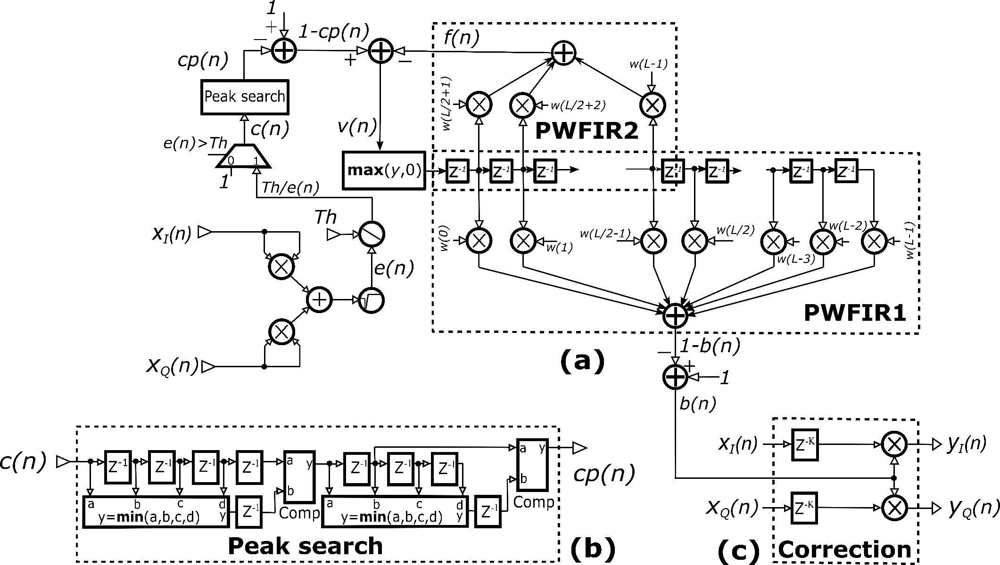
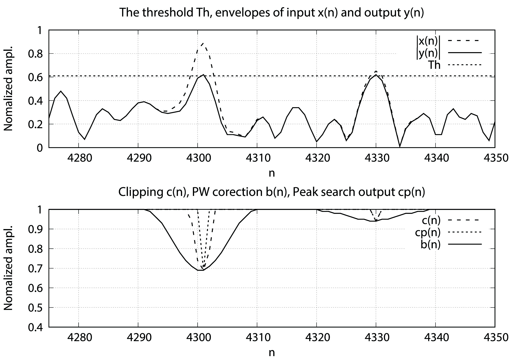
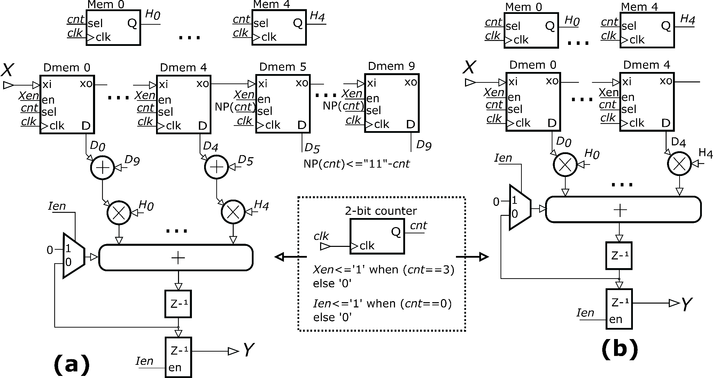

.. _cfr:

Crest Factor Reduction (CFR)
============================

Motivation for Peak to Average Power Ratio Reduction
----------------------------------------------------

Modern modulation schemes (LTE, 5G NR and similar) generate signals which
inherently contain frequent and large peaks in time domain. In the presence of
high Peak to Average Power Ratio (PAPR), PAs must be heavily backed off and/or
further linearized by DPD. The efficiency of DPD algorithms themselves is also
affected by high PAPR.

The solution which helps DPD to compensate PA distortions more efficiently is to
deal with the signals with reduced PAPR. In this case, it is possible to
increase transmitted signal average power, avoid PA operation in non-linear
region and consequently improve PA energy and spectral efficiency. 

The utilization of PAPR reduction techniques in modern telecommunication systems
becomes a “must have” option, at least at BTS side.

NOTE: Peak to Average Power Ratio Reduction (PAPR) is also known as Crest Factor
Reduction (CFR). The Crest Factor Ratio (CFR) is defined as a ratio between the
signal magnitude maximum value and the signal average value:

**<<ADD EQN>>**

Peak to Average Power Ratio (PAPR) is defined as:

**<<ADD EQN>>**

Peak Windowing Method 
---------------------

Hard Clipping (HC) technique cuts the peaks when the envelope *\|x(n)\|* of the
complex signal *x(n)* exceeds user selectable threshold level *Th*:

**<<ADD EQN>>**

HC is quite simple. However it produces high signal distortion due to hard
clipping. Undesirable side effects of HC include in-band signal distortion which
is measured by Error Vector Magnitude (EVM) and out-band signal distortion,
measured by Adjacent Channel Power Ratio (ACPR). For that reason, we have
adopted Peak Windowing (PW) algorithm for PAPR reduction. In PW, the large
signal peaks are multiplied with a windowing function to smooth the sharp edges
at clipping points. In fact, the above clipping coefficients *c(n)* are
replaced by *b(n)*:

**<<ADD EQN>>**

where w\ *(n)* is some symmetrical windowing function (Hann’s for example). 

**<<ADD EQN>>**

The difference between *c(n)* and *b(n)* is minimized by choosing narrow window
lengths which results in lower EVM degradation. However, if clipping operation
happens frequently, neighboring correction windows overlap and the difference
between *c(n)* and *b(n)* becomes larger. 

For LTE standards, usually 30.72 MS/s sample rate is used. CFR block itself runs
at 122.88 MHz clock frequency, i.e. four times the data rate in order to bust
hardware DSP blocks processing power. Of course, these frequencies can easily be
changed to conform to any other similar telecommunication standard.

The implementation of PW consists of several stages. The PW processing
operations are depicted in Figure 2.a. 

To determine the envelope *e(n)=|x(n)|*, complex I/Q input components are squared,
summed and square-rooted. The envelope *e(n)* is then compared to the threshold
level *Th*. 

If the magnitude of *e(n)* is greater than threshold *Th*, clipping coefficient
*c(n)* is calculated as the value of *Th* divided by *e(n)*. Otherwise, *c(n)*
value is set to one.

Peak search block is introduced in PW processing stage to find local minimum
values of the signal *c(n)*. If the input sample is not local minimum, then the
output of Peak search block (signal *cp(n)*\ ) is set to one. 

   Figure 2: (a) Peak windowing architecture (b) Peak search block and (c)
   Correction block.

Figure 2.a shows the architecture of PWFIR filter. PWFIR consists of
feed-forward (PWFIR1) and feedback (PWFIR2) sub-filters.

PWFIR takes input signal *v(n)* and generates 1-\ *b(n)*. Negative values of
*v(n)* are replaced by zeros before driving the rest of the filter. The sequence
*b(n)* is gain correction of the input sequences *x*\ :sub:`I`\ *(n)* and 
*x*\ :sub:`Q`\ *(n)*. 

Prior to applying the correction, *x*\ :sub:`I`\ *(n)* and *x*\ :sub:`Q`\ *(n)*
are properly delayed to compensate for the delay (latency) introduced by the
implementation of PWFIR and other CFR preprocessing stages. Hence, CFR output
*y(n)* is constructed as shown in Figure 2.c.

In order to reduce overlapping, the feedback structure (PWFIR2) is introduced.
The feedback path adjusts the next filter input value. Looking forward to when
clipped input value reaches the center tap (Figure 2.a), the contribution of all
previous input values (between first and center tap) are calculated and used for
correction of the next input value. At the time when incoming clipped signal
reaches the unity weighted center tap, the contributions from all previous
values have already been compensated. This reduces the EVM degradation when
successive peaks in *cp(n)* occur within the period shorter than half of the
window length.

   Figure 3: CFR algorithm in action. Bottom graph gives c(n), cp(n) and b(n),
   top graph shows Th, e(n)=|x(n)| and envelope of the CFR output \|y(n)\|.

As mentioned before, PWFIR filter structure is divided into two parts. PWFIR1
produces output signal 1-\ *b(n)* while PWFIR2 generates the feedback signal
*f(n)* (Figure 2.a). For the implementation, we have chosen Hann windowing
function:

**<<ADD EQN>>**

PWFIR is designed to implement 1 <= L <= 40 tap filters where the filter length
L and the filter coefficients *w(k)* are easily software programmable.

The architecture of PWFIR filter is based on multiply-and-accumulate (MAC)
circuitry.

The architecture is area optimized. The number of utilized multipliers is
reduced by multiplexing input data and operating the block at the clock
frequency which is four times higher than the sample rate. PWFIR operates at the
clock frequency of 122.88 MHz while input and output data rates are both equal
to 30.72 MS/s. 

The architecture of CFR FIR filter is further optimized by exploiting the fact
that the filter has symmetrical window coefficients. The required number of
multiplications is reduces by factor of 1/2. Consequentially, the number of FPGA
DSP blocks used for the filter implementation is also reduced.

   Figure 4: The architecture of PWFIR1 (a) and PWFIR2 (b) modules.

The detailed architecture of PWFIR1 is given in Figure 4.a. The coefficients are
indexed from 0 to 19. Whenever the condition is true, the coefficient at index
*j* is determined by following equation. Otherwise, the coefficient is set to
zero.

**<<ADD EQN>>**

PWFIR2 architecture is given in Figure 4.b. It provides up to 20 programmable
filter coefficients which are stored in the register array and indexed from 0 to
19. The coefficients of PWFIR2 are determined by following equation whenever
condition is met. Otherwise, the coefficient value at index *j* is set to zero.

