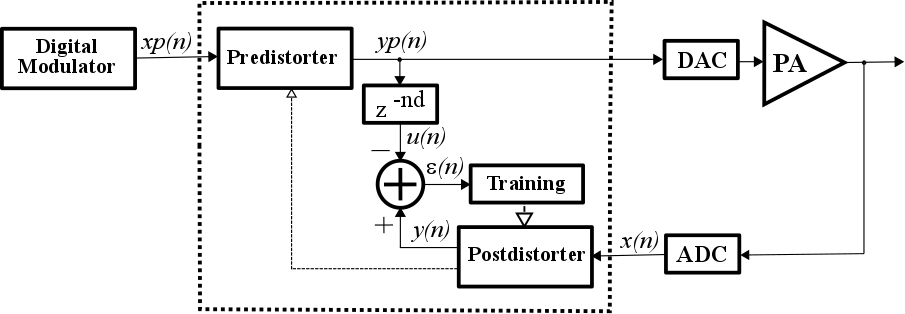

LimeADPD
========

Indirect Learning Architecture
------------------------------

The simplified block diagram of an indirect learning architecture is given in
Figure 1. Please note that RF part in both TX (up to PA input) neither in RX
(back to base-band frequency) paths is shown for simplicity.

A delay line compensates ADPD loop *(yp(n)* to *x(n))* delay. Post-distorter is
trained to be inverse of power amplifier. Predistorter is a simple copy of
post-distorter. When converged:

.. math:: \epsilon (n)=0, yp(n)=y(n) => x(n)=xp(n),

hence, PA is linearized.

Figure 1: Indirect learning architecture

Complex Valued Memory Polynomial
--------------------------------

LimeADPD algorithm is based on modelling nonlinear system (PA and its inverse in
this case) by complex valued memory polynomials which are in fact cut version of
Volterra series which is well known as general nonlinear system modelling and
identification approach. In this particular case “cut version” means the system
can efficiently be implemented in real life applications.

For a given complex input:

.. math:: x(n)=x_I(n)+jx_Q(n)

complex valued memory polynomial produces complex output:

.. math:: y(n)=y_I(n)+jy_Q(n)
.. math:: y(n)=\sum_{i=0}^{N} \sum_{j=0}^{M} w_{ij} x(n-i)e(n-i)^j

where:

.. math:: w_{ij}=a_{ij}+jb_{ij}

are the polynomial coefficients while *e(n)* is the envelope of the input. For the envelope calculation, two options are considered, the usual one:

.. math:: e(n)=\sqrt{x_I(n)^2+x_Q(n)^2}

and the squared one:

.. math:: e(n)=x_I(n)^2+x_Q(n)^2

Usually, squared one is used in ADPD applications since it is simpler to
calculate and in most cases provides even better results.

In the above equations, *N* is memory length while *M* represents nonlinearity
order. Hence, complex valued memory polynomial can be taken into account both
system memory effects and the system nonlinearity.

LimeADPD Equations
------------------

Based on discussions given in previous sections and using signal notations of
Figure 1, ADPD pre-distorter implements the following equations:

.. math:: yp(n)=\sum_{i=0}^{N} \sum_{j=0}^{M} w_{ij} xp(n-i)ep(n-i)^j
.. math:: xp(n)=xp_I(n)+jxp_Q(n)
.. math:: ep(n)=xp_I(n)^2+xp_Q(n)^2

while post-distorter does similar:

.. math:: y(n)=\sum_{i=0}^{N} \sum_{j=0}^{M} w_{ij} x(n-i)e(n-i)^j
.. math:: x(n)=x_I(n)+jx_Q(n)
.. math:: e(n)=x_I(n)^2+x_Q(n)^2

Note that pre-distorter and post-distorter share the same set of complex
coefficients **w**\ :sub:`ij`. Delay line is simple, and its output is given by:

.. math:: u(n)=yp(n-nd)

Training Algorithm
------------------

ADPD training algorithm alters complex valued memory polynomial coefficients
**w**\ :sub:`ij` in order to minimize the difference between PA input **yp**\
*(n)* and **y**\ *(n)*, ignoring the delay and gain difference between the 
two signals. Instantaneous error shown in Figure 1 is calculated as:

.. math:: \epsilon(n)=\sqrt{(u_I(n)-y_I(n))^2+(u_Q(n)-y_Q(n))^2}

Training is based on minimising Recursive Least Square (RLS) *E(n)* error:

.. math:: E(n)=\frac{1}{2}\sum_{m=0}^{n} \lambda^{n-m} \epsilon(m)^2, \lambda<1

by solving linear system of equations:

.. math:: \frac{\partial E(n)}{\partial a_{kl}}=0;  \frac{\partial E(n)}{\partial b_{kl}}=0;
.. math:: k=0,1,...,N; l=0,1,...,M 

Any linear equation system solving algorithm can be used. Lime ADPD involves LU
decomposition. However, iterative techniques such as Gauss – Seidel and Gradient
Descent have been evaluated as well. LU decomposition is adopted in order to get
faster adaptation and tracking of the ADPD loop.

