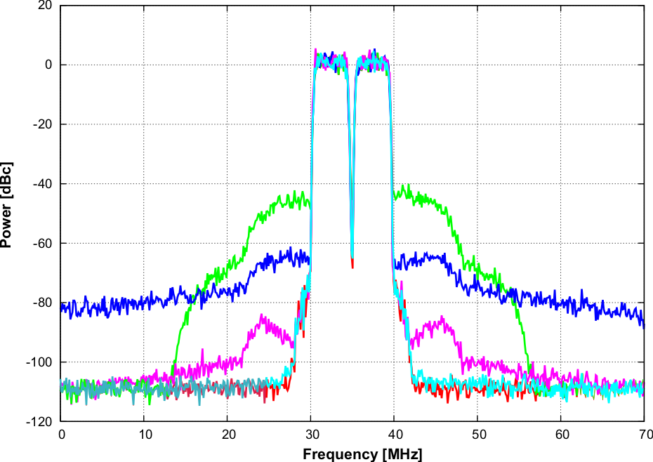

.. toctree::
   :maxdepth: 2
   :hidden:

   Introduction <self>
   limeadpd
   limeadpd-iq
   cfr
   implementation/index
   programming/index
   limesuite
   configuration/index
   userguide/index
   dpdresults/index
   cfr-results
   conclusion

Lime Adaptive Digital PreDistortion
===================================

Power amplifiers (PA) are nonlinear devices and their linearization is highly
desired for a number of reasons. In case of RF PAs, linearization improves power
efficiency and subsequently reduces running cost of the wireless infrastructure.

Considering the PA performance for a given air interface, ACPR and  EVM are the
key considerations to provide support for sophisticated modulation schemes,
multicarrier signals and high modulation bandwidths.

Here, we present Lime Microsystems solution for PA linearization based on
adaptive digital predistortion (ADPD) and crest factor reduction (CFR).
