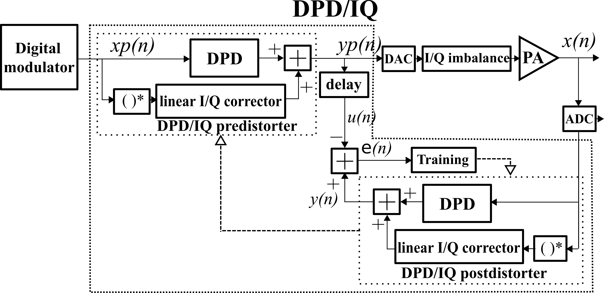

LimeADPD I/Q - DPD with I/Q Imbalance Mitigation
================================================

Transmitter I/Q imbalance
-------------------------

Complex-valued signal *x(t)*, exposed to the source of frequency-independent I/Q imbalance, results to the signal *y(t)*:

.. math:: y(t)=\eta_1 x(t) + \eta_2 x^*(t)
.. math:: \eta_1=\cos \frac{\phi}{2} + j \epsilon \sin\frac{\phi}{2} 
.. math:: \eta_2= \epsilon \cos\frac{\phi}{2} - j \sin\frac{\phi}{2} 

The parameters *ε* and *φ* represent the amplitude and phase imbalance terms. 
For wideband signals, I/Q imbalance manifests frequency-dependent behavior caused by analogue components in I and Q modulator paths. 

LimeADPD I/Q method is used for joint PA linearization and RF transmitter I/Q imbalance mitigation. It is designed for implementation in software-defined radio (SDR) base stations (BS).

LimeADPD I/Q Indirect Learning Architecture
-------------------------------------------

The modification of LimeADPD which performs joint PA nonlinearity minimization and I/Q imbalance mitigation is given in Figure 2.

Pre-distorter and post-distorter blocks are divided into Memory Polynomial (MP) based non-conjugate and linear conjugate sub-blocks, as presented in Figure 2. The pre-distorter MP non-conjugate part (named with DPD in the Figure 2) takes at input signal *xp(n)*:

.. math:: xp(n)=xp_I(n)+jxp_Q(n)

and it is dedicated to minimization of PA and transmitter nonlinearity effects. The linear conjugate part, denoted as I/Q corrector, takes at input the complex-conjugated signal *xp*(t)*: 

.. math:: xp^*(n)=xp_I(n)-jxp_Q(n)

and is introduced to suppress the effects of transmitter’s I/Q imbalance.

Figure 2: Indirect learning architecture for I/Q image rejection and PA linearization

Complex Valued Memory Polynomial
--------------------------------

For a given complex input:

.. math:: x(n)=x_I(n)+jx_Q(n)

and conjugated complex input signal:

.. math:: x^*(n)=x_I(n)-jx_Q(n)

LimeADPD I/Q model produces complex output:

.. math:: y(n)=y_I(n)+jy_Q(n)
.. math:: y(n)=\sum_{i_1=0}^{N_1} \sum_{j_1=0}^{M_1} g_{i_1j_1} x(n-i_1)e(n-i_1)^{j_1} + \sum_{i_2=0}^{N_2} \ h_{i_2} x^*(n-i_2) 

where:

.. math:: g_{i_1j_1}=a_{i_1j_1}+jb_{i_1j_1}
.. math:: h_{i_2}=c_{i_2}+jd_{i_2}

are the polynomial coefficients while *e(n)* is the squared envelope of the input:

.. math:: e(n)=x_I(n)^2+x_Q(n)^2

In the above equations, parameter *N1* in the represents the DPD memory length and *M1* is the nonlinearity order. The I/Q corrector block is modeled by linear FIR filter block with length *N2*.

The advantage of LimeADPD I/Q is low complexity in terms of reduced number of complex valued coefficients.

LimeADPD I/Q Equations
----------------------

Based on discussions given in previous sections and using signal notations of Figure 2, the ADPD I/Q pre-distorter implements the following equations:

.. math:: yp(n)=\sum_{i_1=0}^{N_1} \sum_{j_1=0}^{M_1} g_{i_1j_1} xp(n-i_1)ep(n-i_1)^{j_1} + \sum_{i_2=0}^{N_2} \ h_{i_2} xp^*(n-i_2)
.. math:: xp(n)=xp_I(n)+jxp_Q(n)
.. math:: xp^*(n)=xp_I(n)-jxp_Q(n)
.. math:: ep(n)=xp_I(n)^2+xp_Q(n)^2

while the post-distorter does similar:

.. math:: y(n)=\sum_{i_1=0}^{N_1} \sum_{j_1=0}^{M_1} g_{i_1j_1} x(n-i_1)e(n-i_1)^{j_1} + \sum_{i_2=0}^{N_2} \ h_{i_2} x^*(n-i_2) 
.. math:: x(n)=x_I(n)+jx_Q(n)
.. math:: x^*(n)=x_I(n)-jx_Q(n)
.. math:: e(n)=x_I(n)^2+x_Q(n)^2

Note that the pre-distorter and post-distorter share the same set of complex
coefficients **g** and **h**. Delay line is simple and its output is given by:

.. math:: u(n)=yp(n-nd)

LimeADPD I/Q Training Algorithm
-------------------------------

The LimeADPD I/Q training algorithm alters complex valued memory polynomial coefficients in order to minimize the difference between PA input *yp(n)* and *y(n)*. The instantaneous error shown is calculated as:

.. math:: \epsilon(n)=\sqrt{(u_I(n)-y_I(n))^2+(u_Q(n)-y_Q(n))^2}

Training is based on minimising Recursive Least Square *E(n)* error:

.. math:: E(n)=\frac{1}{2}\sum_{m=0}^{n} \lambda^{n-m} \epsilon(m)^2, \lambda<1

by solving linear system of equations:

.. math:: \frac{\partial E(n)}{\partial a_{i_1j_1}}=0;  \frac{\partial E(n)}{\partial b_{i_1j_1}}=0; \frac{\partial E(n)}{\partial c_{i_2}}=0;  \frac{\partial E(n)}{\partial d_{i_2}}=0;
.. math:: i_1=0,1,...,N_1; j_1=0,1,...,M_1;  i_2=0,1,...,N_2; 

Following RLS algorithm, after every training step, the system of equations is solved. Lime ADPD I/Q involves LU decomposition for equation solving method.

