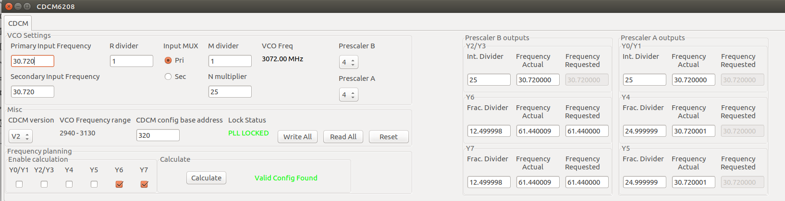

LimeSDR-PCIe-5G Control Windows
===============================

.. note::

   The board LimeSDR-PCIe-5G incorporates three LMS7002M ICs, named with LMS1, LMS2, LMS3.
   
   For DPD demonstration the LMS1 and LMS3 are used. Two transmitter channels (named with channels A and B) are implemented by LMS1. 
   The DPD monitoring paths are realized by two LMS3 receiver paths. The pre-driver TQM8M9079 PAs 
   are embedded on the board, located in LMS1 transmit paths.

   The LMS2 is used for 5G signal transmission and implements two transceiver chains. 
   Moreover, the LMS2 TX chain includes the CFR block, specifically optimized for 100 MHz bandwidth waveforms. 

Board related controls window
-----------------------------

The window *Board related controls* is opened by *Modules* |rarr| *Board Controls*.
It contains the software controls for on-board analog switches.

.. figure:: ../images/board-related-controls-5G.png

   Figure 11: The Board related controls' dialog.

More details about  *Board related controls* will be provided in Board Configuration Guide section.

LMS2/LMS3 clock configuration
-----------------------------

Clocks for the LMS2 and LMS3 analog interfaces are provided by the onboard CDCM6208 clock generator. 
Whenever it is required to change the frequency value of on-board DAC and ADC, please follow:

* Open *Modules* |rarr| *CDCM6208*.
* Check the *Yi* CDCM outputs in the *Frequency planning* box.
* Then, enter desired frequency in the *Frequency requested* box. 
* Click *Calculate*. If a valid configuration is found, the text *Valid Config Found* appears. 
* Then, click *Write All* to write the new configuration into the CDCM6208 chip. 
* At the end, uncheck the *Yi* check box.

   Figure 12: CDCM6208 dialog.

The CDCM output map is given in the Table 2.

.. list-table:: Table 2: CDCM2 Output map. 
   :header-rows: 1

   * - Output
     - Use

   * - Y0/Y1
     - LMS2 DAC clock

   * - Y2/Y3
     - LMS2 DAC alternative clock (UNUSED)

   * - Y4
     - LMS2 ADC1 clock 

   * - Y5
     - LMS2 ADC2 clock

   * - Y6
     - LMS3 ADC1 clock 

   * - Y7
     - LMS3 ADC2 clock 

More details about CDCM configuration will be provided in Board Configuration Guide section.

LMS1 CFR, LMS3 RxTSP controls window
--------------------------------------

The LMS1 Crest factor reduction (CFR) controls are provided via the *LMS1 CFR controls
window*, which is the part of LimeSuiteGUI (Figure 13). 
 
The *LMS1 CFR controls* is opened by *Modules* |rarr| *LMS1 CFR, LMS3 RxTSP controls*.

The window provides:

* Selection of the TX channels A or B.
* Change of PWFIR filter order, in the range from 1 to 40.
* To set the clipping threshold.
* To change the coefficients of post-CFR FIR filter.

 .. figure:: ../images/lms1-cfr-controls-5G.png

   Figure 13: LMS1 CFR controls dialog

The radio buttons A_CHANNEL and B_CHANNEL select one of the TX paths: A or B (Figure 13). 
Two CFR blocks and accompanying post-CFR FIR filters are implemented in transmit 
paths A and B. Before any modification of CFR parameters is made, the 
TX path must be selected using the previously specified radio buttons.

The CFR processes the LTE signals which data rate depends on signal bandwidth.
For 5MHz and 10MHz bandwidths it is 30.72MS/s; for 15MHz and 20MHz the rate is 61.44MS/s.

The data processing rate is changed via Interpolation option.

CFR parameters for each of the TX paths include:

* *Bypass CFR* – when is checked, the CFR is bypassed.
* *Interpolation* option has possible values 0 and 1 (Figure 13). The value 1 selects the
  interpolation in front of CFR block. (see Figure 6). In this case the data rate
  of signals entering the LMS1 CFR block is 61.44 MS/s. Otherwise, when 0 value is chosen,
  the interpolation is used after CFR and post-CFR FIR blocks. In this case the
  data rate of signals is 30.72 MS/s. 
* *CFR order* is the integer value representing the CFR PWFIR order. When
  *Interpolation* = 0 the CFR order maximum is 40; When control signal
  *Interpolation* = 1, maximum PWFIR order is 20.
* *Threshold* is the floating point number in the range from 0.0 to 1.0,
  determining the clipping threshold. The value is normalized to input signal
  amplitude maximum. The parameter *Threshold* determines the amount of PAPR
  reduction. For example, the value of 0.707 reduces the input signal PAPR by 3dB.
  When value of 1.0 is chosen, the clipping operation is bypassed. 
* *Gain* is the digital gain following CFR block. The default value is set to 1.0.

The low-pass FIR filter follows the CFR block (Figure 6). The options for 
FIR filter coefficients reading end programming are provided. 
When *Coefficients* button is pressed, the post-CFR FIR filter coefficients 
are read from FPGA registers and displayed in the new window.

New FIR coefficients can be loaded from ``.fir`` file and displayed in the window.
After pressing OK button, the window is closed and new coefficients are programmed
into the FPGA registers.

The FIR is bypassed when *Bypass FIR* is checked.

.. note::

   Since distinct post-CFR FIR filters exist in
   A and B channels, it is required to select the transmitting channel before
   changing FIR coefficients. For this purpose the radio buttons *A_CHANNEL/B_CHANNEL* are used. 

.. note::

   For different LTE waveforms (5MHz, 10MHz, 15MHz and 20MHz) the corresponding

   * ``FIR_05MHz_30p72MHz.fir``,
   * ``FIR_10MHz_30p72MHz.fir``, 
   * ``FIR_15MHz_61p44MHz.fir``,
   * ``FIR_20MHz_61p44MHz.fir``
  
   are provided in folder ``<LimeSuiteGUI install folder>/LimeSuite/build/bin/FIRcoefficients``. 
   The coefficient values, stored in the ``.fir`` file, are derived after normalized FIR filter 
   coefficient values are multiplied with constant integer number of 2\ :sup:`15`\ -1.

To save or read FPGA configuration the window (Figure 13) provides three buttons: 

* *Refresh all* button reads the configuration which has been already programmed 
  in the FPGA and updates the configuration in the window.     
* *Read* button which reads the ``.ini2`` file, updates the configuration shown in
  the window and also, automatically programs the FPGA registers. 
  The configuration includes all settings which are shown in the window, 
  including the CFR and post-CFR FIR coefficients for both channels.
* *Save* button is used to read the configuration from FPGA and save it into the ``.ini2`` file.

Additional controls:

* *ResetN* - used for debugging purposes, should be always checked
* *LMS1 txen* - used for debugging purposes, should be always checked
* *DPD cap.en.* - when checked, the captured signals are sent to DPDViewer instead of FFTViewer.
  When DPD is used should be always checked. 
* *LMS3 mon.path* - specifies the DPD monitoring path, when checked, the LMS3 receiver 
  is used, otherwise it is the LMS1 receiver. By default should be checked. 
* *DPD/CFR enable* - should be checked whenever CFR and DPD operations are required.
  When unchecked, DPD/CFR operation is bypassed.

.. note::

   When LMS1 DPD & CFR are used, the *DPD cap.en.* is checked. 
   When LMS2 Equaliser is being calibrated, the *DPD cap.en.* must be unchecked.

At right side, the window provides bypass check boxes and value editing fields for the
following LMS3 RX static corrector modules:

* Phase I/Q imbalance correction (*Rx PHCORR*)
* Gain I/Q imbalance correction (*Rx GCORRI* and *Rx GCORRQ*)

LMS2 CFR controls window
-------------------------

The LMS2 is used for 5G signal transmission and implements two transceiver chains consisting of:

* interpolation block,
* the CFR block,
* post-CFR low-pass FIR filter eliminating residual spectrum regrowth after CFR block,
* static I/Q imbalance and DC offsets correctors,
* Equaliser FIR filters, dedicated for dynamic I/Q imbalance mitigation.

The window *LMS2 CFR controls* is opened by *Modules* |rarr| *LMS2 CFR controls*.

 .. figure:: ../images/lms2-cfr-controls-5G.png

   Figure 14: LMS2 CFR controls dialog

The radio buttons A_CHANNEL and B_CHANNEL select one of the LMS2 TX paths: A or
B (Figure 14). 

The data rate of signals is 122.88MS/s or 245.76 MS/s.
The data processing rate can be changed via Interpolation option specified by *Bypass HB1*.
The *Bypass HB1* should be unchecked and 245.76 MS/s used.

LMS2 CFR parameters for each of the TX paths include:

* *Bypass HB1*, when checked, the interpolation is skipped (Figure 7). In this 
  case, the data rate of signals is 122.88 MS/s. When *Bypass HB1* is left unchecked (in this case *HB1 delay* must be **checked**), 
  the data rate of the signals, which are processed by CFR, is 245.76 MS/s.
* *Bypass CFR* – when is checked, the CFR is bypassed.
* *CFR order* is the integer value representing the CFR PWFIR order. 
  The CFR order maximum is 32;
* *Threshold* is the floating point number in the range from 0.0 to 1.0,
  determining the clipping threshold value, normalized to signal
  full-scale. For example, the value of 0.707 reduces the input signal PAPR by 3dB.
  When value of 1.0 is chosen, the clipping operation is bypassed. 
* *Gain* is the digital gain following CFR block. The default value is set to 1.0.

.. note::

   Interpolation require that *HB1 Bypass* is **unchecked** and *HB1 delay* is **checked**.

The LMS2 low-pass post-CFR FIR filter follows the CFR block. By pressing the button *Coefficients*, 
the FIR coefficients are read from FPGA registers and displayed. 
Also, new coefficients can be loaded from ``.fir`` file and displayed.
After pressing OK button and new coefficients are programmed into FPGA. 
Option *Bypass FIR* bypasses the post-CFR FIR operation.

Option *TX input source* selects the NCO signal or regularly transmitted waveform.

At right side of the window, the window provides bypass check boxes and value editing fields for 
various LMS2 RX and TX static corrector modules:

* Phase I/Q correction (*PHCORR*)
* Gain I/Q correction (*GCORR*)
* I and Q components DC offset correction (*DCCORRI* and *DCCORRQ*)

.. note::
 
   The coefficients for 100MHz Low-Pass FIR are provided by ``FIR_100MHz_245p76MHz.fir``
   located in folder ``<LimeSuiteGUI install folder>/LimeSuite/build/bin/FIRcoefficients``. 
   The coefficient values are derived after normalized coefficient values are multiplied
   with 2\ :sup:`15`\ -1.

Additional buttons are provided: 

* Button *ResetEQU*, which resets the LMS2 Equaliser (the effect is that the Equaliser is bypassed).
* Button *Read* reads the ``.ini2`` file, updates the configuration shown in
  the window and also, automatically programs the FPGA registers.
  The configuration includes all settings which are shown in the window, 
  including the CFR, post-CFR FIR and Equaliser coefficients for both A and B transmitting channels.
* *Save* button is used to read the configuration from FPGA and save it into the ``.ini2`` file.
