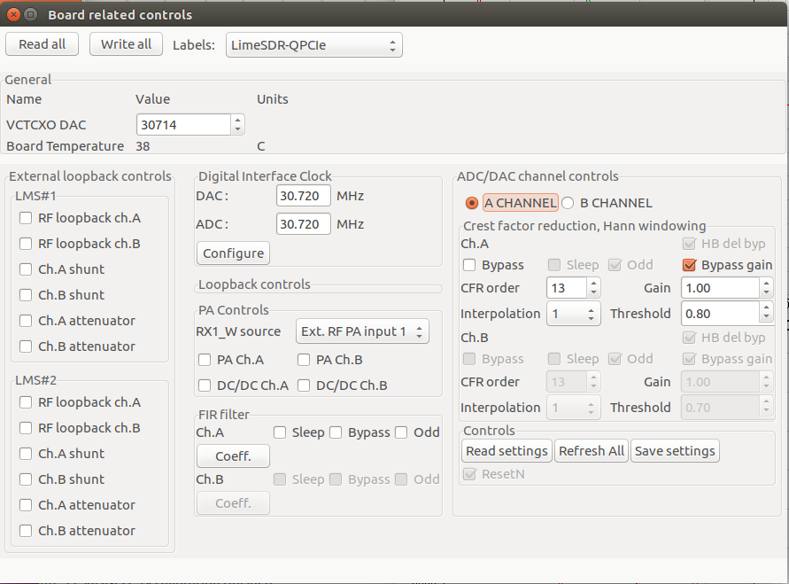

LimeSDR-QPCIe Control Windows
=============================

.. note::

   For DPD demonstration two transceiver channels are implemented in LimeSDR
   QPCIe board (named with channels A and B). Also, two power amplifiers are
   required that are connected to the two different transmit paths. 

Board Related Controls window
-----------------------------

The Crest factor reduction (CFR) controls have been implemented in the *Board
related controls window*, which is the part of LimeSuiteGUI (Figure 15). The
window provides:

* Selection of the transmitter channels A or B.
* Change of PWFIR filter order, in the range from 1 to 40.
* Setting the clipping threshold.
* To change the coefficients of post-CFR FIR filter.
* To turn on/off the LimeNET internal PAs and DCDCs (only if  LimeNET internal
  PAs are used).

   Figure 15: The Board related controls' dialog.

The radio buttons A_CHANNEL and B_CHANNEL select one of the TX paths: A or
B (Figure 15). 

Two different CFR blocks and accompanying post-CFR FIR filters in the FPGA
gateware are dedicated to different transmit paths A and B. Therefore, before
any modification of CFR parameters is made, the TX path must be selected
using the previously specified radio buttons. 

CFR parameters for each of the TX paths include:

* *Bypass* – when is checked, the CFR is bypassed.
* *Interpolation* has possible values 0 and 1 (Figure 15). The value 1 selects the
  interpolation in front of CFR block. (see Figure 10). In this case the data rate
  of signals entering the CFR is 61.44 MS/s. Otherwise, when 0 value is chosen,
  the interpolation is used after CFR and post-CFR FIR blocks. In this case the
  data rate of signals is 30.72 MS/s. 
* *CFR order* is the integer value representing the CFR PWFIR order. When
  Interpolation=0 the CFR order maximum is 40, otherwise, when control signal
  interpolation = 1, maximum PWFIR order is 20.
* *Threshold* is the floating point number in the range from 0.0 to 1.0,
  determining the clipping threshold. The value is normalized to input signal
  amplitude maximum. The parameter Threshold determines the amount of PAPR
  reduction. For example, the value of 0.7 reduces the input signal PAPR by 3dB.
  When value of 1.0 is chosen, the clipping operation is bypassed. 
* *Gain* is the digital gain following CFR block. The default value is set to 1.0.

When interpolation or CFR order values are changed in the window, the new Hann
windowing coefficients are automatically calculated and are programmed to the
dedicated CFR registers located in FPGA gateware. 

The low-pass post-CFR FIR filter follows the CFR block
(Figure 10). The options for filter coefficients reading end programming are
provided. When *Coeff.* button in the *Board related controls* window is
pressed, the post-CFR FIR filter coefficients are read from FPGA
registers and displayed in the new window. New post-CFR FIR coefficients can be
loaded from ``.fir`` file and displayed in the same window. After
pressing OK button, the window is closed and new coefficients are programmed
into the FPGA registers. 

.. note::

  For different LTE waveforms
  (5MHz, 10MHz, 15MHz and 20MHz) the corresponding files are provided in
  folder ``<LimeSuiteGUI install
  folder>/LimeSuite/build/bin/FIRcoefficients``. 

  Since different post-CFR filters exist for
  different channels, it is required to select the transmitting channel before
  changing filter coefficients. For this purpose the radio buttons
  *A_CHANNEL/B_CHANNEL* are used. 

The post-CFR filter length depends on Interpolation. When interpolation is 0,
the data rate of post-CFR FIR signals is 30.72 MS/s (see Figure 10). In this case
the post-CFR FIR order is 40. Otherwise, when value 1 is chosen, the
interpolation is done before the CFR and post-CFR FIR blocks. In this case, the
data rate of signals is 61.44 MS/s and filter order maximum is equal to 20. 

To save or read gateware configuration the *Board related controls* window
(Figure 15) provides three buttons: 

* *Read settings* which reads the ``.ini2`` file, updates the configuration shown in
  the window and also, automatically programs the FPGA gateware (the CFR blocks
  and post-CFR FIR filters),
* *Refresh* button reads the configuration which is already programmed in the FPGA
  and updates the configuration in the window,
* *Save settings* is used to read the configuration from FPGA and save it into the
  ``.ini2`` file.

Beside the CFR and post-CFR FIR configuration, the *Board related controls* window
controls the internal LimeNET Base station PAs and DC/DC convertors. Namely, the
LimeNET Base station PAs and DC/DCs can be turned on/off programmatically. 

The check buttons *DC/DC ChA and ChB* (Figure 15) are used to switch on/off the
LimeNET BS DC/DC convertors, which provide power supply to PAs (only if LimeNET
internal PAs are used). Additionally, the LimeNET BS PAs can be turn on/off
using *PA ChA and ChB* check buttons. Note that when the control is checked, the
DCDC or PA is turned on. 

