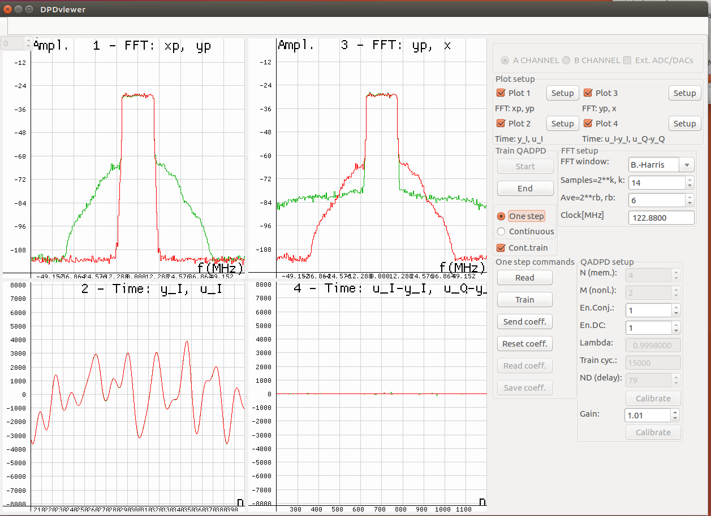

DPDViewer Window
================

.. note::
   The LMS#3 is used as DPD monitoring path. 
   Clock for the LMS3 analog interfaces should be set to 61.44 MHz. 
   The clock configuration is provided via LimeSuiteGUI CDCM6208 window.

   * Open Modules → CDCM6208
   * Check the Y6 and Y7 CDCM outputs (for LMS#3 ADCs) in the Frequency planning box.
   * Enter frequency of 61.44 in the Frequency requested boxes. Click Calculate.
   * Click Write All to write the new configuration into the CDCM6208 chip.

.. note:: 
   * open Modules → LMS#1 CFR controls window
   * check boxes: ResetN, LMS1 txen, DPD cap.en., LMS3 mon.path, DPD/CFR enable
  

.. figure:: ../images/dpdviewer-before-training.png

   Figure 16: DPDViewer: ADPD signals before training

PC/GUI implements graphical display for demo and debugging purposes. GUI is
capable to show important ADPD signals in FFT (frequency), time and
constellation (I vs Q) domains. 

During training process software application periodically finds new DPD/IQ
coefficients and stores them into dedicated predistorter memory blocks 
located in FPGA. Around 16k I/Q samples are used in the training process. 
Because PA and I/Q imbalance impairments change slowly with temperature
drift and component aging, and the number of mathematical operations is also reduced 
because of reduced coefficients set, the postdistorter operations are realized as low-priority
background tasks, repeated after time interval of several seconds.

The DPD viewer window is displayed through
*Modules* |rarr| *DPDViewer*.

Figures 16 and 17 show important ADPD signals before and after the algorithm
convergence. Signals are captured by GUI executed by CPU Core.

ADPD parameters given in the QADPD setup part of the window are: 

* *N(mem.)* — the DPD model memory order, maximum value N=4.
* *M (nonl.)* — the nonlinearity order, maximum value M=3,
* *Lambda* — the RLS forgetting factor. It is real value less than 1.0.
* *Train cycles* — number of train cycles before new DPD coefficients are 
  programmed.
* *ND delay* — the DPD delay line length (in range from 74-80).
* *Gain* — floating point number representing the DPD digital gain. When Gain is
  obtained by gain calibration process, the PA output power is maintained at the
  save power level after DPD linearization process is performed compared to
  initial power. When Gain value is chosen to be less than the value derived after
  Gain calibration, the power at PA output is increased, as well the amount of
  distortion. 

   Figure 17: DPDViewer: ADPD signals before training

Before training (Figure 16), predistorter signals *yp* and *xp* are equal (plot
1).  Signal *x* as a measure of PA output is distorted (plot 3). Waveforms *y*
and *u* are very different (plot 2) which results in huge error (plot 4) which
ADPD has to minimize.

After ADPD training (Figure 17), signal *yp* (plot 1) is predistorted in order to
cancel PA distortion components. *x* as a measure of PA output is now linearized
(plot 3). Excellent match between *y* and *u* waveforms in both time and
amplitude scale (plot 2). ADPD error (plot 4) is minimized. Improvement in PA
linearization can be seen by comparing *yp* and *x* spectra of plot 3.

The basic operations describing the DPD operations from LimeSuite GUI are as
follows:

1. Start the waveforms (running the LTE stack, or loading the test waveform)
2. Select the transmitting channel (A or B)
3. Press *Calibrate ND* delay button.

.. note::

   Expected values for delay ND are in the range [74-80]. 

.. note::

   If in consecutive DPD calibration procedures, different, random values for ND
   are obtained, which are out of specified range, there is a RF reflection or
   interference. To solve this, check the RF cables. The cable dedicated for DPD
   monitoring path (from PA’s coupling output to board) should have
   strong shield. Else, 10dBm-20dBm RF attenuator should be placed at
   board receive input, rather than at PA’s coupling output.

4. Press *Calibrate gain* to determine DPD digital gain.

.. note::

   If LTE stack is running, the DPD calibration procedure requires the data
   payload, generated by connecting mobile phone(s) to BTS and executing Magic
   Iperf application on both sides.

.. note::

   The DPD digital gain should be in range [1.0-3.0], otherwise, LMS7002M
   channel A receiver gain settings must be modified. 

5. In the part of the window *Train DPD*, press the *Start* button, check *Cont.
   train* option and then select *Continuous* option.
6. To stop the DPD training process, first press *One step*, then *End* button,
   above.
7. Repeat steps 2-6 for the other channel .

.. note::

   For DPD coefficient reset use *resetCoeff* button. The result of this operation
   is the same as DPD is bypassed.

.. note::

   For DPD coefficient reset use resetCoeff button. The result of this operation
   is the same as DPD is bypassed.

When LTE stack is running there is a possibility to just monitor the signals
without performing the DPD training. In this case, the sequence of operations is
as follows:

1. Select the channel first (A or B).
2. In the part of the window *Train DPD*, press the *Start* button, uncheck *Cont.
   train* option and select *Continuous* option.
3. To stop monitoring operation, first press *One step*, then *End* button.
4. Repeat steps 1-3 for the other channel .

